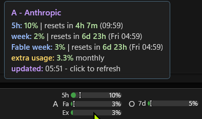
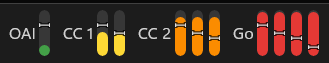
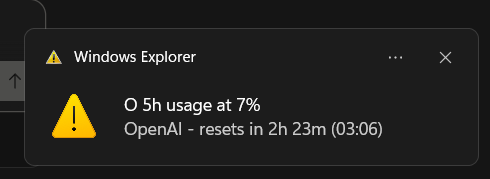

# Taskbar AI Quota Bars

Shows Anthropic Claude, OpenAI/Codex, and Google Antigravity AI agent and LLM subscription quota usage as compact bars on the Windows 11 taskbar.
Can show on the primary taskbar only, all taskbars, or one specific monitor.

## What It Shows

Each visible account gets one compact taskbar column. Choose among the provider's supported bars: 5-hour, weekly, Anthropic Fable weekly, and Anthropic monthly extra usage. Antigravity maps available short-window and weekly Gemini pools to its bars; Claude/GPT pool limits appear in the tooltip. Selected bars auto-hide when the provider does not return that quota.

- stacked layout: horizontal bars stack vertically and fill left-to-right
- vertical layout: selected bars sit side-by-side and fill bottom-up

Hover for percentages, reset times, plan and provider details, errors, and retry countdowns. Click a column to refresh that account or open its provider dashboard, depending on settings and provider support. Right-click a column for Settings, Refresh all, provider actions, and show/hide toggles. Hidden accounts are not polled, and the last visible account cannot be hidden.

Bars can show compact quota labels (`5h`, `7d`, `Fa`, `Ex`) and percentage text with never, hover, or always visibility plus adaptive, left, center, or right alignment. They use configurable green/yellow/orange/red thresholds, with an optional colorblind palette. Optional pace ticks compare quota usage with elapsed time in each reset window and have caret, full-line, edge-notch, and dot styles with a configurable color. Stale errors can mark labels and tooltips with `!`.

It can also fire a Windows notification when an account first crosses the red threshold on a selected bar, so you don't have to keep glancing at the bars. The notification re-arms once usage drops back below the threshold.

## Setup

Install **Taskbar AI Quota Bars** from the Windhawk catalog. For local development, `install-windhawk.ps1` installs `local@taskbar-ai-quota.wh.cpp`. On a fresh install, click the **AI +** taskbar tile to open the native settings window and add an account. Existing Windhawk settings are imported once when upgrading. Settings autosave; most appearance and behavior edits do not immediately re-query providers, while new or identity-changed accounts and stale accounts made visible can fetch.

Configure a provider and label, then select at least one supported quota bar. Each provider-and-label pair must be unique. Sign in to Anthropic/OpenAI from the settings window or a quota column's right-click menu. Antigravity reads quota from its running app or CLI session.

## Signing In

The mod runs its own OAuth sign-in and refreshes the access token itself, so the bars keep working without re-running any CLI. A column that needs authentication shows "click to sign in" - just left-click it to start the flow. You can also right-click a column, open **Sign in**, and pick the account:

- **Anthropic**: a browser opens to claude.ai. After you approve, the page shows a code like `abc...#xyz...`; paste it into the prompt the mod shows.
- **OpenAI**: a browser opens to OpenAI's authorization page; the mod catches the redirect on `localhost:1455` (falling back to `1457`) automatically, so there's nothing to paste. If the Codex CLI is signing in at the same time the port may be busy - close it and retry.
- **Google Antigravity**: no separate mod sign-in is needed. Keep the signed-in Antigravity app or CLI running so the mod can query its local language server. Older IDE builds also need an open workspace.

Use **Sign out** in the same menu to delete an Anthropic/OpenAI stored token. Renaming a label preserves its stored sign-in when possible. Removing an Anthropic/OpenAI account asks whether to retain or delete its stored sign-in; removing an Antigravity account only confirms the removal.

Antigravity servers without pooled-quota support can show only their current limiting quota. Weekly stays unavailable and pace ticks are disabled for that fallback.

## Settings

Right-click any quota column and choose **Settings...**. Useful settings include:

- provider (Anthropic, OpenAI, or Google Antigravity) per account
- account labels
- account ordering and taskbar visibility
- per-account 5-hour, weekly, Anthropic Fable weekly, and Anthropic monthly extra-usage bar selection
- bar length, thickness, and layout
- bar mode: used (fills as quota is consumed) or remaining (fills with quota left and shows "X% remaining"); threshold colors always represent consumed quota
- pace ticks comparing quota usage with elapsed time (or quota remaining with time remaining), with caret, full-line, edge-notch, and dot styles and a configurable color
- label position: hidden, left, top, right, or bottom
- account-label and bar-text font sizes
- account, label, bar, and tray spacing
- compact bar labels (`5h`, `7d`, `Fa`, `Ex`), hidden by default
- percentage text: never show, show on hover (default), or always show, with adaptive, left, center, or right alignment
- optional Codex Spark details in OpenAI tooltips, hidden by default
- click action: refresh account or open provider dashboard (Antigravity always refreshes)
- cloud poll interval presets plus a custom interval (Antigravity polls its local server every minute)
- taskbar monitor mode: primary, all, or a detected display with its resolution
- color thresholds with palette-matched previews
- threshold notifications (toast when an account crosses the red threshold)
- colorblind palette
- stale-warning marker
- temporary threshold-spanning test accounts for previewing current taskbar visuals

Bar dimensions and font sizes use sliders with precise numeric spinner controls. Spacing, thresholds, and custom polling use spinners. Concise hover help explains polling, pace ticks, Codex Spark, and stale warnings. Each non-account page can be reset independently without removing accounts or credentials.

## Security Notes

For Anthropic and OpenAI, the mod owns its OAuth credentials end to end: it signs in, stores the access and refresh tokens, and refreshes them itself. Tokens are stored encrypted with Windows DPAPI (current user) in the mod's own Windhawk storage; they are never written to disk in plaintext.

The mod never reads or writes the OpenCode, Claude Code, or Codex credential files. Refresh tokens are used only against the provider token endpoints and are never sent as bearer tokens to the quota endpoints.

Signing in uses the public OAuth clients of the official CLIs (Claude Code for Anthropic, Codex for OpenAI) with PKCE. Antigravity uses only its signed-in loopback language server and stores no Google token.

## Limitations

- Windows 11 taskbar only.
- x86-64 only.
- Specific displays use detected taskbar order: `Display 1` is primary and later entries are secondary taskbars.
- Anthropic/OpenAI require one browser sign-in per configured account.
- Antigravity requires a signed-in app or CLI session to remain running; older IDE builds may also require an open workspace.
- OpenAI sign-in needs `localhost:1455` (or `1457`) free for the browser redirect.
- Anthropic and OpenAI sessions refresh automatically; sign in again if a stored session is missing, invalid, or revoked.

## Suggestions & Bugs

Have a suggestion or found a bug? [Open an issue](https://github.com/Cleroth/windhawk-taskbar-ai-quota/issues/new).
